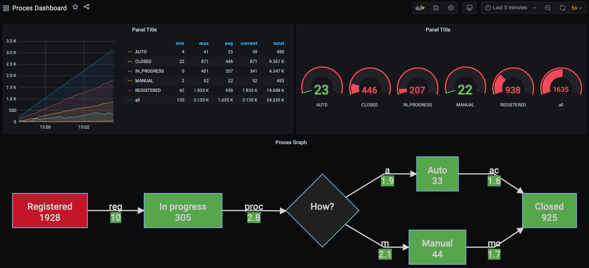

# Spring-Boot - Monitoring Stack in Docker-Compose

This project demonstrates how to connect well-known monitoring tools with **Spring-Boot** App. 
It shows how these tools can use the metrics and logs that the application produces to monitor the application.

For this purpose, a simple process with few stages has been implemented in the application. Process is persisted in a **PostgreSQL**.
This process automatically starts and moves to next steps (it is scheduled).

Process, and it's stages are monitored and metrics are exposed with **Prometheus**. 
Logs form application are sent from docker via **Logstash** to the **Elasticsearch**. You can search them in **Kibana**.
**Prometheus** and **Elasticsearch** are connected as data sources to **Grafana** where dashboards for process and application monitoring are available.



This repository contains:

- **Spring Boot Web Application**
    - configured:
        - logging in JSON
        - logging to Logstash
        - database connection 
        - building docker image with jib & distroless
        - exposing metrics with prometheus endpoint `/actuator/prometheus`
    - implemented:
        - entity representing process with few stages
        - scheduled jobs that initiate new processes and move processes to next stages automatically (can be configured in [application.yaml](src/main/resources/application.yaml) or via environment variables in [docker-compose.yaml](docker-compose/docker-compose.yaml))
        - custom micrometer metrics for measuring database tables state (e.g. table row count with filtering)
            - how many processes are in each state
            - how many transitions between stages happen
- **PostgreSQL** + **pgAdmin**
- **Prometheus**
    - preconfigured with scrapping web-app metrics in [prometheus.yaml](docker-compose/prometheus/prometheus.yaml)
- **Grafana**
    - preloaded prometheus and elasticsearch datasource from [datasources.yaml](docker-compose/grafana/datasources.yaml)
    - preloaded dashboard [dashboards.yaml](docker-compose/grafana/dashboards.yaml) and [dashboards directory](docker-compose/grafana/dashboards)
        - Dashboard to track process progress based on metrics from prometheus and logs from elasticsearch
        - [JVM micrometer dashboard](https://grafana.com/grafana/dashboards/4701)
        - [Spring Boot Statistic dashboard](https://grafana.com/grafana/dashboards/67560)
- **ELK** - Logging stack
    - **Elasticsearch**
        - configured as single node instance
    - **Logstash** - preconfigured with [logstash.conf](docker-compose/logstash/pipeline/logstash.conf)
        - exposing UDP port for logs receiving
        - sending logs to elasticsearch
        - filtering JSON messages from web-app and parsing it into fields for better searchability and monitoring
    - **Kibana**
        - preconfigured with connection to elasticsearch
        - indices from elasticsearch are available for searching
    
    

## How to start

Copy [.env.example](docker-compose/.env.example) as [.env](docker-compose/.env) and edit properties you want. 

You need to set HOST_IP variable with your host IP to send your logs to Logstash. You can get your IP with command below.

```shell
cp docker-compose/.env.example /docker-compose/.env
ifconfig | grep "inet " | grep -v 127.0.0.1 | cut -d\  -f2
```

If needed you can change web app image name in [build.gradle.kts](build.gradle.kts) and [.env](docker-compose/.env).

Build web app image.

```shell
./gradlew jibDockerBuild
```

Run monitoring stack

```shell
cd docker-compose
docker-compose up -d
```

## How to use

Few minutes after running you should be able to open in browser

Elasticsearch's indices at: http://localhost:9200/_cat/indices?v

Kibana connected to elasticsearch at: http://localhost:5601

Web App with prometheus metrics: http://localhost:8080/actuator/prometheus

Grafana with preloaded data sources and dashboards at: http://localhost:3000/

pgAdmin able to connect to PostgreSQL at: http://localhost:8070/

## Todo

- fix problem with elasticsearch index health=yellow
- add Sleuth
- add traefik
- add jaeger
